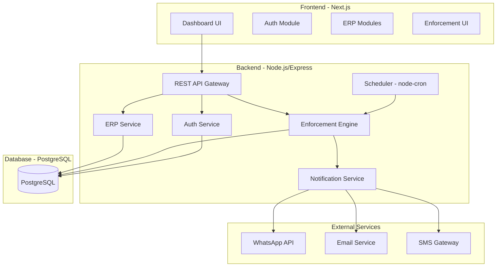
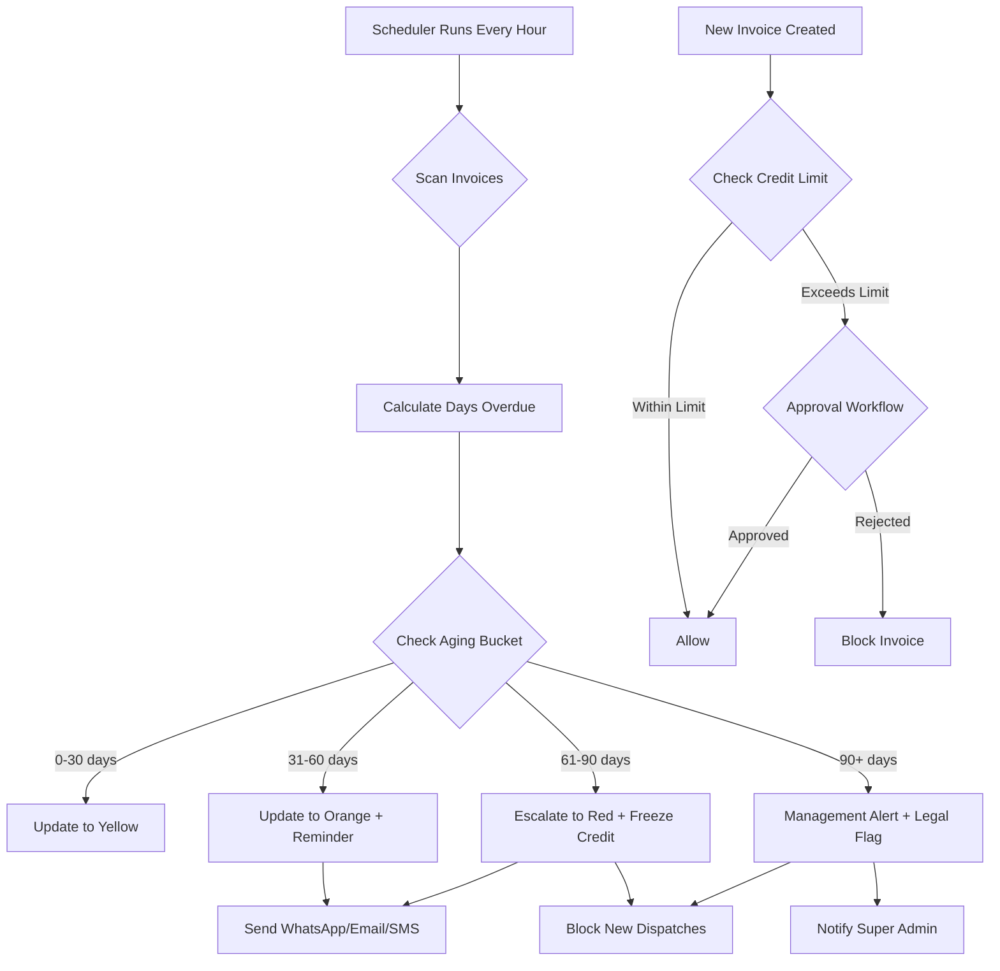

# ESCROW BMS — System Architecture & Design Document

> **"ERP stores data. ESCROW BMS enforces discipline."**

---

## 1. System Architecture



### Key Design Decisions
| Decision | Choice | Rationale |
|----------|--------|-----------|
| Frontend | Next.js (App Router) | SSR, file-based routing, React ecosystem |
| Backend | Node.js + Express | Event-driven, fast I/O for real-time enforcement |
| Database | PostgreSQL | ACID compliance, JSON support, robust for financial data |
| Auth | JWT + RBAC | Stateless, role-based access |
| Scheduler | node-cron | In-process job scheduling for reminders/escalations |
| Notifications | Multi-channel | WhatsApp, Email, SMS via pluggable adapters |

---

## 2. Database Schema

### Core ERP Tables

#### `companies`
| Field | Type | Description |
|-------|------|-------------|
| id | UUID PK | Company ID |
| name | VARCHAR(255) | Company name |
| gst_number | VARCHAR(15) | GST registration |
| address | TEXT | Address |
| settings | JSONB | Company-level config |
| created_at | TIMESTAMP | Created timestamp |

#### `users`
| Field | Type | Description |
|-------|------|-------------|
| id | UUID PK | User ID |
| company_id | UUID FK | Company ref |
| email | VARCHAR(255) | Email (unique per company) |
| password_hash | VARCHAR(255) | Bcrypt hash |
| name | VARCHAR(255) | Full name |
| role | ENUM | super_admin, admin, user |
| permissions | JSONB | Granular permissions |
| is_active | BOOLEAN | Account status |

#### `customers`
| Field | Type | Description |
|-------|------|-------------|
| id | UUID PK | Customer ID |
| company_id | UUID FK | Company ref |
| name | VARCHAR(255) | Customer name |
| gst_number | VARCHAR(15) | GST number |
| credit_limit | DECIMAL(15,2) | Approved credit limit |
| current_exposure | DECIMAL(15,2) | Current outstanding |
| risk_score | INTEGER | 0-100 risk score |
| risk_level | ENUM | green, yellow, orange, red |
| payment_terms_days | INTEGER | Default payment terms |
| is_credit_frozen | BOOLEAN | Credit freeze flag |
| contact_email | VARCHAR(255) | Primary email |
| contact_phone | VARCHAR(20) | Primary phone |
| address | TEXT | Address |

#### `vendors`
| Field | Type | Description |
|-------|------|-------------|
| id | UUID PK | Vendor ID |
| company_id | UUID FK | Company ref |
| name | VARCHAR(255) | Vendor name |
| gst_number | VARCHAR(15) | GST |
| contact_email | VARCHAR(255) | Email |
| contact_phone | VARCHAR(20) | Phone |

#### `invoices`
| Field | Type | Description |
|-------|------|-------------|
| id | UUID PK | Invoice ID |
| company_id | UUID FK | Company ref |
| invoice_number | VARCHAR(50) | Unique invoice # |
| type | ENUM | sales, purchase |
| customer_id | UUID FK | Customer (sales) |
| vendor_id | UUID FK | Vendor (purchase) |
| date | DATE | Invoice date |
| due_date | DATE | Payment due date |
| subtotal | DECIMAL(15,2) | Before tax |
| tax_amount | DECIMAL(15,2) | Tax |
| total_amount | DECIMAL(15,2) | Total |
| paid_amount | DECIMAL(15,2) | Amount paid |
| balance_due | DECIMAL(15,2) | Remaining |
| status | ENUM | draft, sent, partially_paid, paid, overdue, disputed |
| days_overdue | INTEGER | Computed field |
| aging_bucket | ENUM | current, 0_30, 31_60, 61_90, 90_plus |
| po_number | VARCHAR(50) | PO reference |
| legal_clause | TEXT | Legal terms |
| notes | TEXT | Notes |

#### `invoice_items`
| Field | Type | Description |
|-------|------|-------------|
| id | UUID PK | Line item ID |
| invoice_id | UUID FK | Invoice ref |
| item_id | UUID FK | Inventory item |
| description | TEXT | Description |
| quantity | DECIMAL(10,2) | Qty |
| unit_price | DECIMAL(15,2) | Price |
| tax_rate | DECIMAL(5,2) | Tax % |
| total | DECIMAL(15,2) | Line total |

#### `payments`
| Field | Type | Description |
|-------|------|-------------|
| id | UUID PK | Payment ID |
| company_id | UUID FK | Company ref |
| invoice_id | UUID FK | Invoice ref |
| amount | DECIMAL(15,2) | Payment amount |
| payment_date | DATE | Date |
| payment_mode | ENUM | cash, bank, upi, cheque |
| reference_number | VARCHAR(100) | Transaction ref |
| bank_account_id | UUID FK | Bank account |

#### `ledger_entries`
| Field | Type | Description |
|-------|------|-------------|
| id | UUID PK | Entry ID |
| company_id | UUID FK | Company ref |
| account_type | ENUM | receivable, payable, revenue, expense, asset, liability |
| entity_id | UUID | Customer/Vendor ID |
| invoice_id | UUID FK | Invoice ref |
| debit | DECIMAL(15,2) | Debit amount |
| credit | DECIMAL(15,2) | Credit amount |
| balance | DECIMAL(15,2) | Running balance |
| narration | TEXT | Description |
| date | DATE | Entry date |

#### `inventory_items`
| Field | Type | Description |
|-------|------|-------------|
| id | UUID PK | Item ID |
| company_id | UUID FK | Company ref |
| name | VARCHAR(255) | Item name |
| sku | VARCHAR(50) | SKU code |
| category | VARCHAR(100) | Category |
| unit | VARCHAR(20) | UOM |
| stock_quantity | DECIMAL(10,2) | Current stock |
| unit_cost | DECIMAL(15,2) | Cost price |
| selling_price | DECIMAL(15,2) | Sell price |
| warehouse_id | UUID FK | Warehouse |
| reorder_level | DECIMAL(10,2) | Min stock |

#### `warehouses`
| Field | Type | Description |
|-------|------|-------------|
| id | UUID PK | Warehouse ID |
| company_id | UUID FK | Company ref |
| name | VARCHAR(255) | Name |
| location | TEXT | Address |

#### `bank_accounts`
| Field | Type | Description |
|-------|------|-------------|
| id | UUID PK | Account ID |
| company_id | UUID FK | Company ref |
| bank_name | VARCHAR(255) | Bank name |
| account_number | VARCHAR(50) | Account # |
| ifsc_code | VARCHAR(11) | IFSC |
| current_balance | DECIMAL(15,2) | Balance |

### Enforcement Engine Tables

#### `credit_rules`
| Field | Type | Description |
|-------|------|-------------|
| id | UUID PK | Rule ID |
| company_id | UUID FK | Company ref |
| name | VARCHAR(255) | Rule name |
| condition_type | ENUM | overdue_days, exposure_pct, risk_score |
| threshold | DECIMAL | Trigger value |
| action | ENUM | alert, freeze_credit, block_dispatch, escalate |
| is_active | BOOLEAN | Active flag |
| priority | INTEGER | Execution order |

#### `reminders`
| Field | Type | Description |
|-------|------|-------------|
| id | UUID PK | Reminder ID |
| company_id | UUID FK | Company ref |
| invoice_id | UUID FK | Invoice ref |
| customer_id | UUID FK | Customer ref |
| trigger_day | INTEGER | Days after due (25,45,60,75,90) |
| channel | ENUM | email, whatsapp, sms |
| status | ENUM | pending, sent, failed |
| sent_at | TIMESTAMP | When sent |
| message | TEXT | Content |

#### `escalations`
| Field | Type | Description |
|-------|------|-------------|
| id | UUID PK | Escalation ID |
| company_id | UUID FK | Company ref |
| customer_id | UUID FK | Customer |
| invoice_id | UUID FK | Invoice |
| level | ENUM | yellow, orange, red |
| triggered_at | TIMESTAMP | When triggered |
| resolved_at | TIMESTAMP | Resolution time |
| action_taken | TEXT | Notes |
| assigned_to | UUID FK | User assigned |

#### `risk_scores`
| Field | Type | Description |
|-------|------|-------------|
| id | UUID PK | Score ID |
| customer_id | UUID FK | Customer ref |
| score | INTEGER | 0-100 |
| payment_delay_factor | DECIMAL | Weight |
| dispute_factor | DECIMAL | Weight |
| exposure_growth_factor | DECIMAL | Weight |
| calculated_at | TIMESTAMP | Timestamp |

#### `follow_ups`
| Field | Type | Description |
|-------|------|-------------|
| id | UUID PK | Follow-up ID |
| company_id | UUID FK | Company ref |
| customer_id | UUID FK | Customer |
| invoice_id | UUID FK | Invoice |
| type | ENUM | call, email, visit, legal |
| scheduled_at | TIMESTAMP | When |
| completed_at | TIMESTAMP | Completed |
| notes | TEXT | Notes |
| response | TEXT | Customer response |
| created_by | UUID FK | User |

#### `pod_documents`
| Field | Type | Description |
|-------|------|-------------|
| id | UUID PK | Document ID |
| invoice_id | UUID FK | Invoice ref |
| file_url | VARCHAR(500) | File path |
| eway_bill_number | VARCHAR(50) | E-way bill |
| uploaded_at | TIMESTAMP | Upload time |
| verified | BOOLEAN | Verification status |

---

## 3. Backend API Design

### Authentication
| Method | Endpoint | Description |
|--------|----------|-------------|
| POST | `/api/auth/register` | Register company + super admin |
| POST | `/api/auth/login` | Login, returns JWT |
| POST | `/api/auth/refresh` | Refresh token |
| GET | `/api/auth/me` | Current user profile |

### Customers (with Enforcement)
| Method | Endpoint | Description |
|--------|----------|-------------|
| GET | `/api/customers` | List customers with risk data |
| POST | `/api/customers` | Create customer |
| GET | `/api/customers/:id` | Customer detail + exposure |
| PUT | `/api/customers/:id` | Update customer |
| PUT | `/api/customers/:id/credit-limit` | Set credit limit (admin+) |
| POST | `/api/customers/:id/freeze` | Freeze credit |
| POST | `/api/customers/:id/unfreeze` | Unfreeze credit |
| GET | `/api/customers/:id/aging` | Aging breakdown |
| GET | `/api/customers/:id/risk-history` | Risk score timeline |

### Invoices
| Method | Endpoint | Description |
|--------|----------|-------------|
| GET | `/api/invoices` | List with filters (status, aging) |
| POST | `/api/invoices` | Create invoice (triggers credit check) |
| GET | `/api/invoices/:id` | Invoice detail |
| PUT | `/api/invoices/:id` | Update invoice |
| POST | `/api/invoices/:id/payment` | Record payment |
| GET | `/api/invoices/overdue` | All overdue invoices |
| GET | `/api/invoices/aging-report` | Aging summary |

### Enforcement Engine
| Method | Endpoint | Description |
|--------|----------|-------------|
| GET | `/api/enforcement/dashboard` | Enforcement KPIs |
| GET | `/api/enforcement/alerts` | Active alerts |
| GET | `/api/enforcement/escalations` | Escalation queue |
| POST | `/api/enforcement/rules` | Create automation rule |
| PUT | `/api/enforcement/rules/:id` | Update rule |
| GET | `/api/enforcement/reminders` | Reminder log |
| POST | `/api/enforcement/follow-ups` | Log follow-up |
| GET | `/api/enforcement/capital-impact` | Capital impact report |

### ERP Modules
| Method | Endpoint | Description |
|--------|----------|-------------|
| CRUD | `/api/inventory/*` | Inventory management |
| CRUD | `/api/vendors/*` | Vendor management |
| CRUD | `/api/purchase-orders/*` | Purchase orders |
| CRUD | `/api/bank-accounts/*` | Banking |
| GET | `/api/reports/pnl` | P&L report |
| GET | `/api/reports/balance-sheet` | Balance sheet |
| GET | `/api/reports/gst` | GST report |
| GET | `/api/reports/ledger` | Ledger report |

---

## 4. Frontend Modules & UI Screens

### Module Map
| Module | Screens | Access |
|--------|---------|--------|
| **Dashboard** | Main KPI Dashboard, Enforcement Overview | All |
| **Customers** | List, Detail, Credit Profile, Risk History | All |
| **Invoices** | Create, List, Detail, Aging Report | All |
| **Payments** | Record, History, Bank Reconciliation | Admin+ |
| **Enforcement** | Alerts, Escalations, Reminders, Rules Config | Admin+ |
| **Inventory** | Items, Stock, Warehouses | All |
| **Purchases** | Orders, GRN, Vendor Management | All |
| **Reports** | P&L, Balance Sheet, GST, Ledger, Aging | Admin+ |
| **Settings** | Company, Users, Roles, Credit Rules | Super Admin |

### Key Dashboard Widgets
1. **Total Receivables** — with aging breakdown pie chart
2. **Risk Heatmap** — customers colored by risk level
3. **Overdue Trend** — line chart (30/60/90 day trends)
4. **Collection Efficiency** — gauge chart
5. **Capital Impact** — interest loss calculator
6. **Active Escalations** — real-time escalation count
7. **Upcoming Reminders** — next 7 days
8. **Top Defaulters** — highest overdue customers

---

## 5. Automation & Business Logic

### Rule Engine Flow


### Automation Rules (Configurable)
| Rule | Trigger | Action |
|------|---------|--------|
| Reminder Day 25 | 25 days past due | Email reminder |
| Reminder Day 45 | 45 days past due | WhatsApp + Email |
| Escalation Yellow | 30 days overdue | Flag yellow, notify sales |
| Escalation Orange | 60 days overdue | Flag orange, alert manager |
| Escalation Red | 90 days overdue | Freeze credit, alert admin |
| Credit Block | Exposure > 100% limit | Block new invoices |
| Risk Recalc | Daily | Recalculate all risk scores |
| Dispatch Block | Credit frozen | Prevent order fulfillment |

### Risk Score Calculation
```
Risk Score = (Payment Delay Factor × 40%) + (Dispute Factor × 30%) + (Exposure Growth × 30%)

Payment Delay Factor = Weighted avg days overdue / Payment terms × 100
Dispute Factor = (Disputed invoices / Total invoices) × 100
Exposure Growth = (Current exposure - Avg exposure) / Avg exposure × 100

Risk Level:
  0-25  → Green (Healthy)
  26-50 → Yellow (Watch)
  51-75 → Orange (At Risk)
  76-100 → Red (Critical)
```

---

## 6. User Roles & Permissions

| Permission | Super Admin | Admin | User |
|------------|:-----------:|:-----:|:----:|
| View Dashboard | ✅ | ✅ | ✅ |
| Manage Users | ✅ | ❌ | ❌ |
| Set Credit Limits | ✅ | ✅ | ❌ |
| Freeze/Unfreeze Credit | ✅ | ✅ | ❌ |
| Configure Rules | ✅ | ❌ | ❌ |
| Create Invoices | ✅ | ✅ | ✅ |
| Record Payments | ✅ | ✅ | ✅ |
| View Reports | ✅ | ✅ | ✅ (limited) |
| Approve Over-Limit | ✅ | ✅ | ❌ |
| Manage Inventory | ✅ | ✅ | ✅ |
| View Escalations | ✅ | ✅ | ✅ (own) |
| Resolve Escalations | ✅ | ✅ | ❌ |
| Company Settings | ✅ | ❌ | ❌ |
| Delete Records | ✅ | ❌ | ❌ |

---

## 7. MVP vs Full Version Plan

### MVP (Phase 1 — 8 weeks)
| Feature | Status |
|---------|--------|
| Auth + RBAC | 🏗️ Build |
| Customer Management + Credit Limits | 🏗️ Build |
| Sales Invoices + Payments | 🏗️ Build |
| Ledger System | 🏗️ Build |
| Aging Dashboard + Heatmap | 🏗️ Build |
| Credit Limit Enforcement | 🏗️ Build |
| Automated Reminders (Email) | 🏗️ Build |
| Escalation System (Yellow/Orange/Red) | 🏗️ Build |
| Risk Score Calculator | 🏗️ Build |
| Basic Reports (Aging, Outstanding) | 🏗️ Build |

### Phase 2 (Weeks 9-16)
| Feature | Status |
|---------|--------|
| Full Inventory + Warehouses | 📋 Planned |
| Purchase Orders + GRN | 📋 Planned |
| WhatsApp + SMS Integration | 📋 Planned |
| Bank Reconciliation | 📋 Planned |
| GST Reports | 📋 Planned |
| Follow-up Tracking | 📋 Planned |
| POD Management | 📋 Planned |
| Capital Impact Calculator | 📋 Planned |

### Phase 3 (Weeks 17-24)
| Feature | Status |
|---------|--------|
| P&L + Balance Sheet | 📋 Planned |
| Multi-warehouse Stock | 📋 Planned |
| Advanced Analytics | 📋 Planned |
| API Integrations (Tally, etc.) | 📋 Planned |
| Mobile App | 📋 Planned |
| Multi-company Support | 📋 Planned |
| Audit Trail | 📋 Planned |

---

> [!IMPORTANT]
> This is a **financial enforcement platform**, not just an ERP. Every module must feed data into the enforcement engine. The aging dashboard and risk scoring are always visible, always active.
