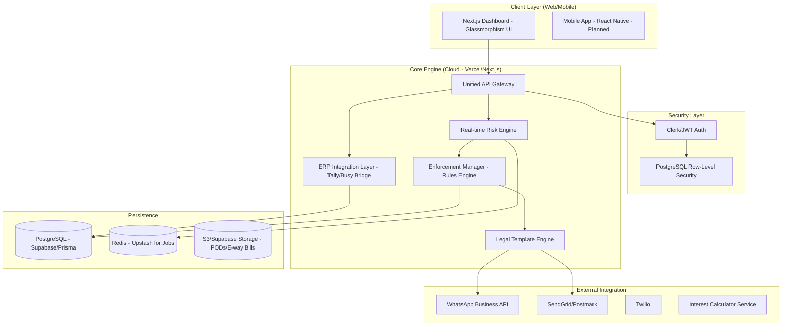

# Refined System Architecture — Escrow BMS (TextileGuard)

> **"From passive accounting to active financial enforcement."**

---

## 1. High-Level Modular Design

---

## 2. Future-Ready Enhancements

### A. Advanced Data Isolation (PostgreSQL RLS)
Instead of filtering by `company_id` in every SQL query, we will use **Database-level Row-Level Security**. 
- Even if a developer makes an error in the code, the database *itself* will prevent data leakage between tenants.
- **Why it matters:** In finance, a single data leak can destroy a reputation.

### B. The "Active" Enforcement Engine
Moving away from a simple "Scheduler" to a **Reactive Event Pattern**:
1. **New Invoice Event:** System immediately checks if it's over the limit.
2. **Late Payment Event:** System triggers immediate risk score recalculation.
3. **Threshold Reached:** Automation instantly blocks new orders and drafts a "Soft Legal Notice."

### C. ERP "Sync-to-Action" Bridge
Most textile businesses use Tally/Busy (Desktop). We will build:
- **Tally Connector Agent:** A lightweight agent on the client's PC that pushes XML/JSON data to our Cloud API.
- **Webhook Listeners:** If using Cloud ERPs, we listen for real-time updates.

### D. Legal-Ready Documentation (Litigation Support)
Unlike simple ERPs, TextileGuard will hardwire legal discipline:
- **Digital POD (Proof of Delivery):** Every invoice needs an acknowledgment.
- **Standardized Clauses:** Invoices will have legally vetted interest and arbitration clauses.
- **Immutable Log:** Every communication (WhatsApp/Email) is logged as evidence for MSME Samadhaan.

---

## 3. Technology Stack (Finalized)

| Layer | Technology | Reason |
|-------|------------|--------|
| **Frontend** | Next.js 14 (App Router) | Best performance, SEO, and developer experience. |
| **Logic/API** | Next.js Server Actions & API Routes | Combined frontend/backend for speed. |
| **Styling** | Vanilla CSS + Framer Motion | Custom, premium "Fintech" look with smooth animations. |
| **Database** | PostgreSQL (Supabase) | Robust, RLS support, and great financial data handling. |
| **ORM** | Prisma / Drizzle | Type-safe database interactions. |
| **Job Queue** | Upstash Redis | Managing background legal notice sends and reminders. |
| **Communication** | Twilio (WhatsApp) | Reliable, high-deliverability messages. |

---

> [!IMPORTANT]
> This architecture is designed for **High Reliability** and **High Security**. It turns the ERP from a "Reporting Tool" into a "Collection Recovery Engine."
